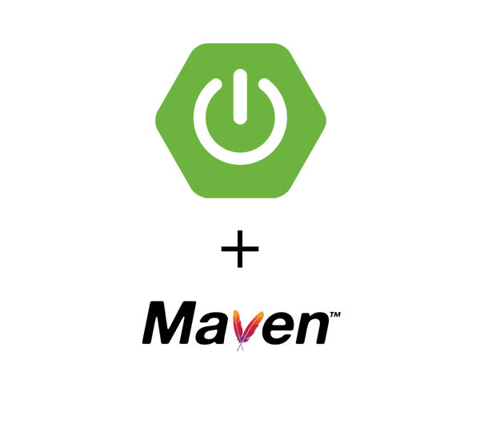

<div align="center">



</div>

# API ficha de Pacientes do Hospital Santa Cruz
 Uma API com swagger em java que consuta lista de Pacientes de um hospital feito com Mysql no docker e Mysql Workbench
 
### 📋 Pré-requisitos

```
- Ter o Java 11 ou superior instalado 
- Ter o Mysql instalado (Caso nao queira usar o mysql tera que baixa a dependencia do seu -
  banco de dados desejado e coloca no POM.xml) 
- IDE de sua preferência: Eclipse | Intellij IDE | Netbeans | SpringToolSuite4
```
## Links para download
### 💻 Download Necessários 
- Mysql --> https://dev.mysql.com/downloads/installer/  | Docker image --> https://hub.docker.com/_/mysql <br>
- Docker Download --> https://www.docker.com/products/docker-desktop  (Opcional) <br>
- JAVA JDK --> https://www.oracle.com/java/technologies/downloads/ <br>

### 📚 IDE´S
- Eclipse --> https://www.eclipse.org/downloads/ <br>
- Intellij --> https://www.jetbrains.com/pt-br/idea/ <br>
- Netbeans --> https://netbeans.apache.org/download/index.html <br>
- SpringToolSuite4 --> https://spring.io/tools

### 🔧 Execução

Para acessar a aplicação :
```
Faça o download ou clone do repositório - [Rodrigo](https://github.com/Rodrigo-Santoos)
e coloque no local de sua escolha.
```


### 🌐 Veja a API funcionando no link em baixo:
- <a href="https://apirest-pacientes.herokuapp.com/swagger-ui.html#/" target="_blank" rel="external">Clique Aqui</a>

```
Abra o projeto com a IDE de preferência.
```
* Aqui estao 3 exemplos.


```
Rodando a Aplicaçao
```
* Para roda a aplicaçao clique na pasta pacientes e clique em src/main/java e clique de novo em
com.paciente.pacientes, dentro dela tera PacientesApplication.java, com o botao direito do mouse 
vai Run as e escolhe Java aplication.


```
Mensagem que esta ok
```
* Se tiver feito tudo certinho voce vera uma mensagem mostrando que a apliçao iniciou sem erros.


```
Aplicaçao no navegador
```
* Depois que esta tudo ok vai no seu navegador e digite localhost:8080/swagger-ui.html e aperte enter, feito isso ira mostrar a tela do Swagger.


```
API no swagger
```
* Esta pronto para adicionar, deletar, atualizar. ver todos ou trazer apenas 1.


```
## 🛠️ Aplicação construída com 

* [Windows:](https://spring.io/tools)
* [Linux:](https://spring.io/tools) 
* [MacOS:](https://spring.io/tools)


## ✒️ Desenvolvido por

* **Rodrigo Oliveira** - [Rodrigo Oliveira](https://github.com/Rodrigo-Santoos)
